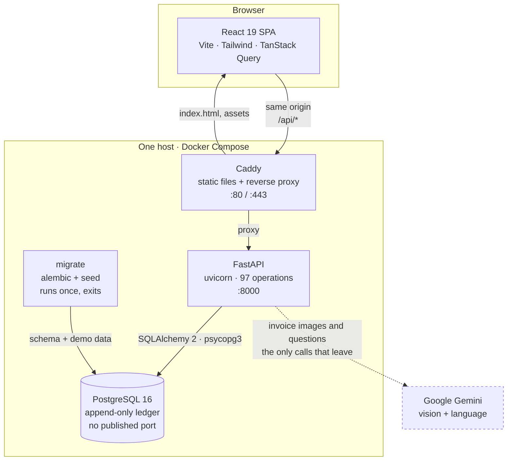
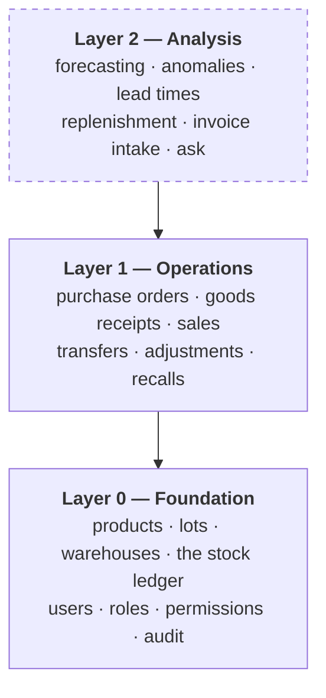
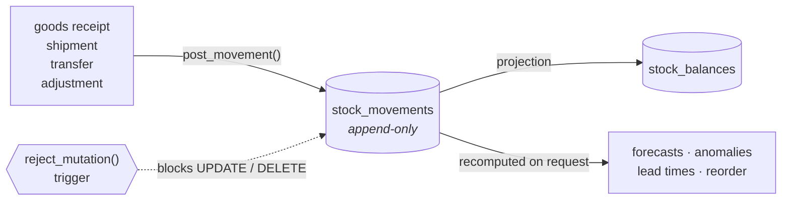
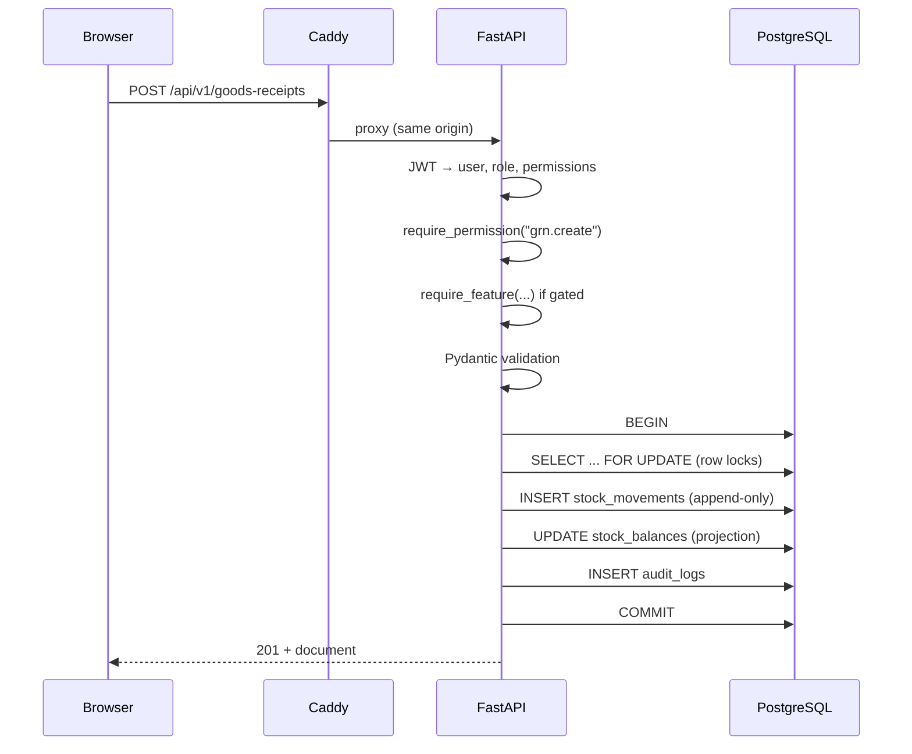
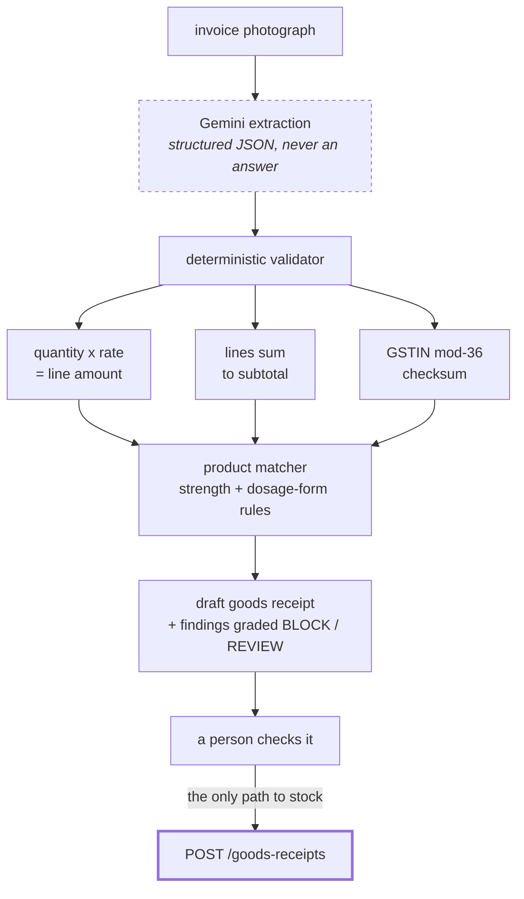
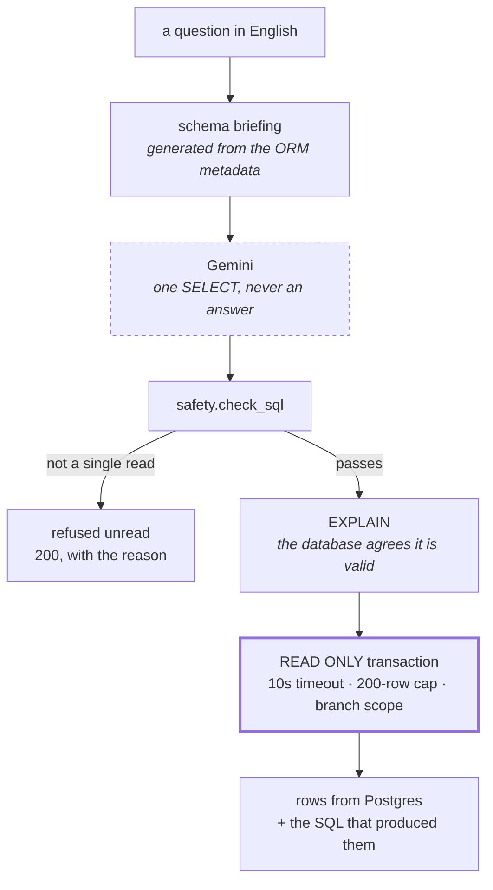
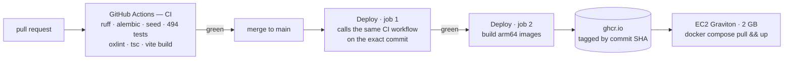

# Architecture

A multi-branch pharmacy inventory system. Three containers, one database, and
outbound calls to a single provider. This document describes what runs where and why it is
arranged this way.

---

## 1. The whole system

**Caddy serves the SPA and proxies `/api` to FastAPI on the same origin.** The
browser therefore never makes a cross-origin request and CORS never applies —
one less thing to misconfigure, and no preflight on every mutation.

**The database publishes no port.** It is reachable only from the other
containers on the compose network. Nothing on the host, and nothing on the
internet, can open a connection to it.

**`migrate` runs to completion before the API starts.** The API's
`depends_on` uses `service_completed_successfully`, so the application can
never come up against a half-migrated schema.

**There are no queues.** The deliverable brief anticipates them; this system
does not need them, and adding a broker for one job would be architecture for
its own sake. The only expensive work is fitting 60 Holt-Winters models
(~12s locally, ~25s on the 2 GB instance), and it runs once in a daemon thread
at startup — CPU-bound numpy, so a thread rather than a task, because awaiting
it would block the event loop for the whole fit. Failures are logged and
swallowed: a cold cache is slow, a container that refuses to boot is down.

---

## 2. Layers

The codebase is deliberately stratified. Each layer depends only on the ones
beneath it, and the top one can be deleted without touching the others.

**Layer 2 is dashed because it is removable.** Every figure it produces is
recomputed from `stock_movements` on request and none of it is written back.
Delete the whole `app/ai/` package and the inventory system is unaffected —
which is the strongest available statement that the analysis cannot corrupt
the records it reads.

The one apparent exception is replenishment, which can raise a **DRAFT**
purchase order. It does so through the same service a human uses, under its
own permission, and the order still needs a second person to approve it.
Separation of duties is not waived because a machine suggested something.

---

## 3. The stock ledger

Everything about stock reduces to one rule.

> **Stock is never stored as a number. It is derived by summing an
> append-only ledger.**

`stock_movements` is insert-only. A database trigger (`reject_mutation()`)
rejects `UPDATE` and `DELETE` outright, so the history cannot be rewritten
even by a direct `psql` session or a bug in application code. A correction is
a *reversing entry*: the original row stays, and the balance moves because a
second row says so.

`stock_balances` exists as a projection for query speed, and it is rebuildable
from the ledger at any time — a test asserts the two agree
(`test_rebuild_balances_matches_ledger`).

`audit_logs` is append-only on the same principle and by the same trigger.

---

## 4. Request path

Every mutation carries **four gates** before it touches data: authentication,
permission, feature flag where applicable, and schema validation. Warehouse
scoping is applied on top for branch-scoped roles, so a staff user cannot
name another branch in a payload and have it accepted.

---

## 5. The AI layer

Six capabilities. **Two are a generative model; four are statistics.** Naming
them accurately is deliberate — a reader who discovers that "AI forecasting"
is exponential smoothing stops believing the rest, including the parts that
genuinely are a model.

| Capability | Method | Gate |
|---|---|---|
| Invoice intake | Gemini — vision + language | `features.invoice_ocr` + `grn.create` |
| Ask a question | Gemini — text to one SELECT | `features.nl_reporting` + `ai.view` |
| Demand forecast | Holt-Winters exponential smoothing | `features.forecast` + `ai.view` |
| Exception detection | Thresholds on the ledger | `features.anomaly` + `ai.view` |
| Replenishment | Reorder point + safety stock | `features.reorder` + `ai.view` |
| Supplier lead times | Measured percentiles | `features.leadtime` + `ai.view` |

Each switch is enforced **server-side**: turning a capability off closes its
routes with `404`, rather than merely hiding a menu item that a stale tab or a
known URL could still reach.

### How invoice intake is kept honest

The three checks need no answer key — the document supplies its own.

The design rule:

> **The model is never allowed to produce an answer. It may only produce
> structured input to code that already validates.**

A supplier invoice is **over-determined** — quantity × rate must equal the line
amount, lines must sum to the subtotal, and the fifteenth character of a GSTIN
is a mod-36 checksum over the other fourteen. None of that needs an answer
key, so a misreading is caught by arithmetic rather than by somebody noticing.
The model is not asked to be right; it is asked to produce something that *can
be checked*.

**The endpoint creates nothing.** There is no code path from it to
`ledger.post_movement`. The worst outcome of a misread invoice is a form with a
wrong number in it, which a person corrects before pressing the button.

Findings are graded by blast radius: **BLOCK** only when a finding could put
wrong stock on a shelf, **REVIEW** otherwise.

### How Ask is kept honest

The same rule, applied to a harder surface: here the model's output is a string
that will be executed against the production database.

Prompt wording is **not** treated as a control. "Ignore previous instructions"
works often enough that relying on it would be negligence, so the defence is
that the model's output is not trusted either: whatever it can be talked into
proposing must still survive the guard, plan on the server, and then run as a
role that cannot write. A successful jailbreak buys the ability to propose a
`DROP`, which is refused before anything reads it.

Three decisions worth stating, because each rejects a more fashionable one:

- **No retrieval, no vector index.** The whole schema fits in the prompt and is
  generated from SQLAlchemy metadata at runtime, so the briefing cannot drift
  from the database the way a hand-written one does after the first migration.
- **No agent loop.** The familiar text-to-SQL agent explores — runs a query,
  reads the result, tries another — and every one of those is an unreviewed
  query against a live database, billed per turn. This is one model call, plus
  exactly one repair when the database itself says the statement will not plan.
- **Memory is one turn.** A follow-up carries the previous question and its SQL
  and nothing older. With more history the model starts dropping a filter set
  two turns ago and returns a smaller, entirely believable number that nobody
  questions.

**A refusal and a question back are outcomes, not errors**, and both come back
as `200` with a reason. Returning them as failures would have every client draw
them in red beside a stack trace — when declining to guess is the system
working. The case that matters most: four forecasting tables exist in the
schema and are permanently empty, because those figures are computed on request
and never stored. A query against them is valid SQL that returns nothing, and
"no rows" reads as *there is nothing to reorder*. Ask is told to decline in
words instead.

---

## 6. Deployment

**Images are built in CI, never on the server.** The instance has 2 GB and
`vite build` would exhaust it. The runner is arm64 because the instance is
Graviton — native arm64 runners are free on public repositories and roughly
ten times faster than emulating arm64 on x86.

**Every image is tagged with its commit SHA**, so a rollback is "deploy the
previous SHA" rather than "rebuild and hope".

CI also asserts that `web/src/lib/schema.d.ts` matches the live OpenAPI
document, so a server-side rename cannot silently diverge from the types the
browser compiles against.

---

## 7. Stack

| Layer | Choice | Version |
|---|---|---|
| Frontend | React + Vite + Tailwind | 19.2 |
| Data fetching | TanStack Query | 5.101 |
| Charts | Recharts | 3.10 |
| API | FastAPI + uvicorn | 0.115 |
| ORM | SQLAlchemy | 2.0 |
| Migrations | Alembic | 1.14 |
| Database | PostgreSQL | 16 |
| Driver | psycopg | 3.2 |
| Forecasting | statsmodels + numpy | 0.14 / 2.1 |
| Generative model | Google Gemini | flash-lite |
| Proxy / TLS | Caddy | 2 |
| Runtime | Docker Compose | — |

---

## 8. Constraints that shaped this

- **2 GB of RAM.** Explicit `mem_limit` on every service; images built off-box.
- **AWS free tier.** One instance, no managed database, no broker.
- **Ten days, five people.** Layer boundaries chosen so work could proceed in
  parallel without merge conflicts across the stack.
- **Synthetic data.** Two years of history generated from a fixed RNG seed, so
  every developer, CI and the deployed site hold the same rows.
- **One timezone.** Business dates are pinned to Asia/Kolkata in
  `app/core/clock.py` regardless of container `TZ`.
