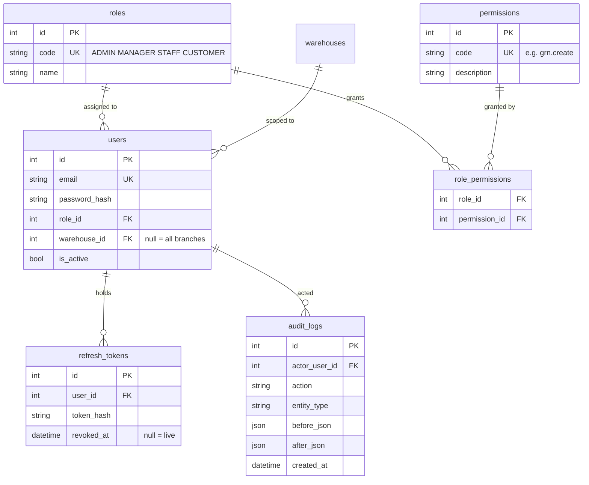
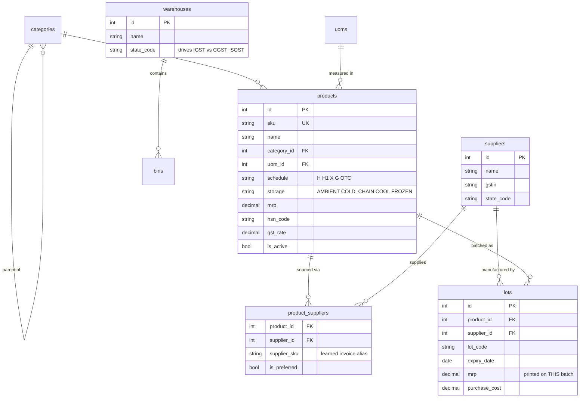
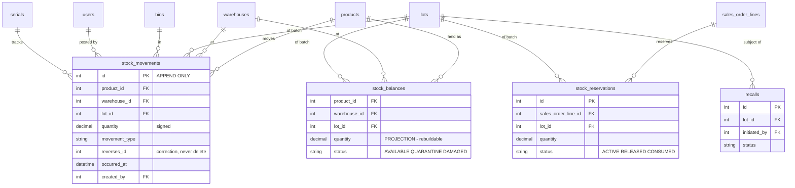
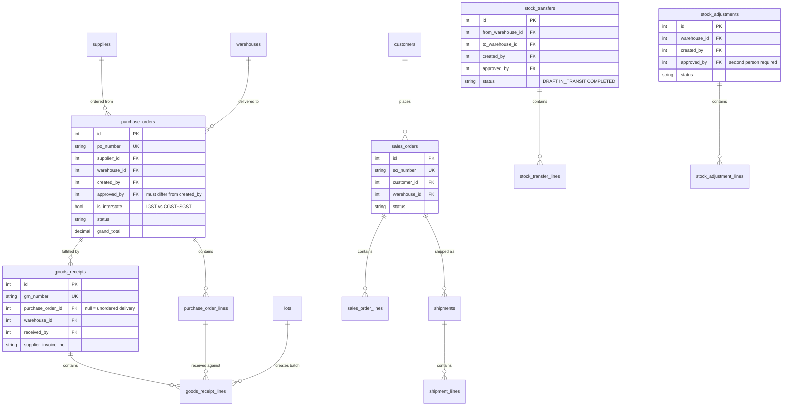
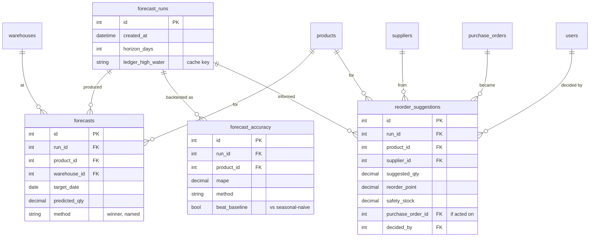

# Entity–Relationship Diagram

42 tables and 2 views, 92 foreign keys. Drawing all of them at once produces
something nobody can read, so they are shown here in five groups that match
how the schema is actually used. Every relationship below was read from
`information_schema` on a live database, not from memory.

---

## 1. Identity, roles and audit

`users.warehouse_id` is the whole of branch scoping: `NULL` means every
branch, a value means that one. `audit_logs` is **append-only** — the same
`reject_mutation()` trigger that protects the ledger rejects `UPDATE` and
`DELETE` here.

---

## 2. Catalogue and master data

Two details that matter:

- **`lots.mrp` is per batch, not per product.** MRP is a legal ceiling printed
  on the pack, so a price rise on a new carton must not reprice older stock
  still on the shelf.
- **`product_suppliers.supplier_sku`** is where invoice intake remembers what a
  distributor calls one of our products. Teach it once, and every later invoice
  from that distributor matches exactly.

---

## 3. The stock ledger

> `stock_movements` is the only source of truth. `stock_balances` is a
> projection kept for query speed and can be rebuilt from the ledger at any
> time — a test asserts the two agree.

Corrections are **reversing entries**: `reverses_id` points at the original
row, which is never removed.

---

## 4. Operations documents

**Separation of duties is structural**, not a convention: `created_by` and
`approved_by` are distinct columns and the service refuses when they match.

A transfer is two ledger postings, not one — stock leaves the source, sits in
`IN_TRANSIT`, and arrives at the destination — so units are never invented or
lost in the gap.

---

## 5. AI-generated artefacts

These tables are **derived artefacts**, not business records. Every one is
recomputed from `stock_movements`; none feeds back into stock. `forecasts`
records which method won *and* that it beat the seasonal-naive baseline — a
series that could not beat "the same weekday last week" says so rather than
quietly using the fancier model.

⚠️ **All four are drawn here and all four are empty in practice.** Nothing in
the application writes a row to any of them: the figures are computed from the
ledger when a screen asks for them and are never persisted. They are modelled
because the shape is part of the design, and the distinction between *present
in the schema* and *populated* matters more here than anywhere else in this
document — a query against them is valid SQL that returns nothing, and "no
rows" reads as *there is nothing to reorder*. Ask is told this explicitly, and
declines such a question in words rather than answering it with an empty table.

**Neither AI feature stores anything here.** Invoice intake's only persistent
trace is the learned alias on `product_suppliers.supplier_sku` and a row in
`audit_logs`; the extraction itself is never saved — it becomes a form, and the
form becomes a goods receipt only if a person submits it. Ask writes nothing at
all: it holds one read-only connection, and its answers live only in the
browser tab that asked.

---

## Views

| View | Purpose |
|---|---|
| `v_stock_by_warehouse` | Balances rolled up per product per branch |
| `v_expiring_stock` | Batches by remaining shelf life, for the expiry screens |

## Supporting tables

`app_settings` and `feature_flags` (administrator-tunable thresholds and the
per-capability off switches, both audited), `document_sequences` (gap-free
document numbering), `calendar_days` (business-day arithmetic), `jobs`
(background job records), `serials` (unit-level tracking where a batch is not
granular enough).
